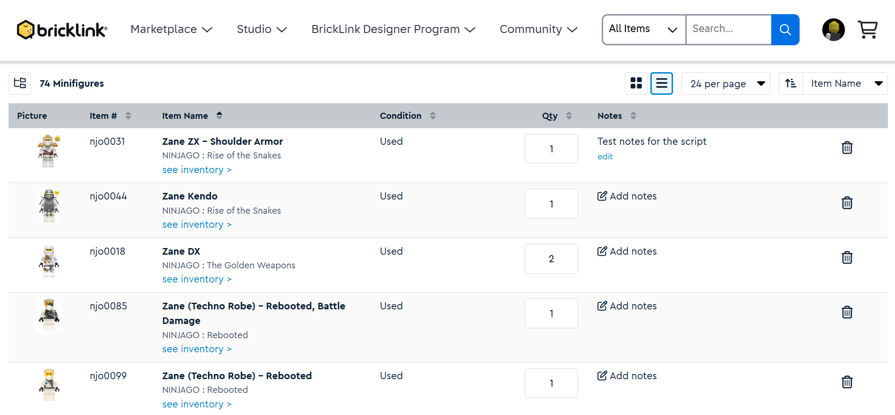
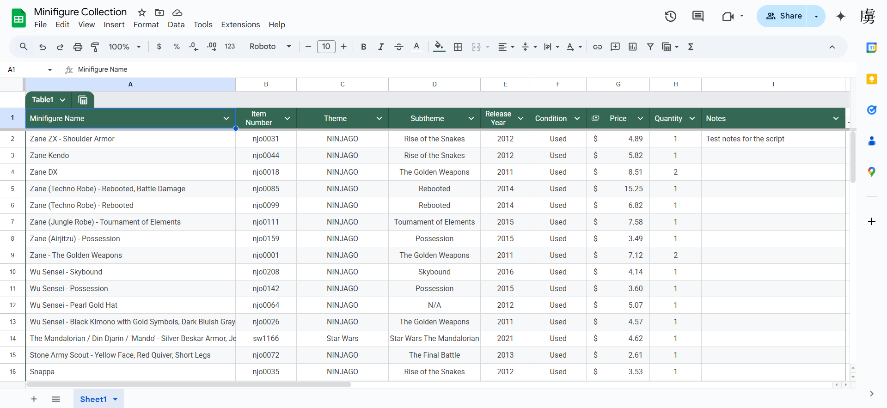

# What is This?
This is a Python script that parses through an individual's 'My Collection' page on BrickLink and logs minifigure information in a seperate Google Sheet worksheet. The distinction between my script and just using 'My Collection' is that my script includes pricing information based on the listed condition of the minifigures. It's also nice to have multiple data storage options (Google Sheets).

# Example Usage on My Personal Collection
My personal collection (that I've been building for the past three years, and is still very small because I am poor) includes 65 list entries (74 minifigs in total including duplicates) on the 'My Collection' page. At it's current stage, the script takes anywhere between 60-80 seconds to run.

Regarding the Google Sheet worksheet, the only thing I manually changed/configured was the header row (Name, Item Number, etc) and other specific formatting options. Other than that, everything was created using the script.

# How to Use
Here is a comprehensive guide to using this script. As long as BrickLink doesn't change or remove sections of the 'My Collection' page the script should work. 

## Prerequisites
### BrickLink Account
The meat of this script relies on scarping data from a BrickLink account, so you will need one. Additionally, you will need at leat one minifigure in your 'My Collection' page. 

### Google Account
Similarly to BrickLink, the other half of this project relies on you having a Google account and a usable Google Sheet worksheet. Before the script can access your worksheet